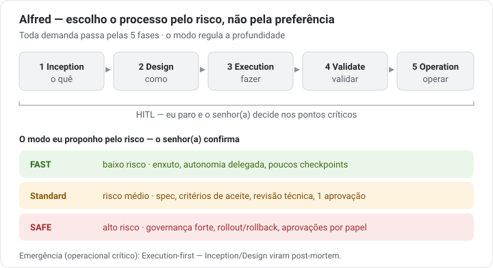

# Alfred Framework

Alfred is a markdown-first framework for hybrid squads (humans + AI agents). It adapts process depth by **risk and complexity**, not preference.

## Implementation status
Layer 1 of the framework is operational for pilots and real demands, and the SQ9 HUB/App adoption path has been exercised with a real multi-repo demand. It is not a full hosted product: host adapters, credentials, real environment parameters, and organization-specific policy remain external. Track closure and remaining gaps in [`docs/layer-1-framework-closure.md`](docs/layer-1-framework-closure.md) and [`docs/implementation-status.md`](docs/implementation-status.md).

## Core idea
- **AI-DLC backbone:** Inception -> Design -> Execution -> Validate -> Operation.
- **SDD clarity brake:** relevant work needs a clear problem, acceptance criteria, risks, and decisions.
- **Risk Mode:** FAST, Standard, or SAFE sets depth, artifacts, checkpoints, and model floor.
- **Human in control:** AI proposes, organizes, executes, and records; humans decide.
- **JIT context:** load only the current phase, lane, demand type, and active specialty.
- **Measured operations:** usage, cost, cache, artifacts, and quality are collected from host transcripts, hooks, telemetry, exports, or approved rate cards; agents do not invent their own usage.



> In the terminal the same flow renders as plain ASCII (see [`core/welcome.md`](core/welcome.md)); richer profiles are optional layers over one source — see [`core/presentation/`](core/presentation/README.md).

## Repository map
One responsibility per folder — the mental model: **`core/` = what Alfred is · `rules/` = how it works · `knowledge/` = what the company mandates · `skills/` = what it knows (opt-in) · `connectors/` = what it reaches (contracts) · `scripts/` = what it automates (optional) · `templates/` = what it produces · `hosts/`+`install/` = where it runs · `docs/`+`examples/` = how to learn and verify.**

- `core/` - principles, architecture, boot, risk mode, squad, model policy, glossary.
- `rules/` - lifecycle, lanes, demand types, common rules, and agents.
- `knowledge/` - the company-wide rules and values every squad inherits (notification/telemetry destinations, catalog allowlist, policies).
- `skills/` - optional specialty packs and coding standards.
- `connectors/` - plug-in contracts for VCS, tracker, notification, telemetry, observability (+ the MCP e-mail adapter in `scripts/adapters/`).
- `metrics/` - measurement contract, baselines, and insight rules.
- `templates/` - framework-owned molds for generated HUB/App artifacts.
- `scripts/` - optional Python helpers by category: `validators/` · `workflow/` · `metrics/` · `adapters/`.
- `hosts/` - per-host entry points (DEVIN CLI, Claude Code, Copilot, Codex); sources live here, installation lands in each host's native location.
- `install/` - turn-key installer (framework + skill + e-mail/telemetry + MCP).
- `docs/` and `examples/` - adoption guidance and the example suite (also the regression evals).

## Where to start
- **I want to USE Alfred in my squad** → run `install/` and read [`docs/onboarding-sigla.md`](docs/onboarding-sigla.md), then [`docs/quickstart-real-demand.md`](docs/quickstart-real-demand.md).
- **I want to UNDERSTAND how it works** → [`core/README.md`](core/README.md) → [`core/risk-mode.md`](core/risk-mode.md) → [`rules/README.md`](rules/README.md).
- **I want to CHANGE the framework** → [`AGENTS.md`](AGENTS.md) (invariants + validation) and [`docs/plan/implementation-plan-2.0.0.md`](docs/plan/implementation-plan-2.0.0.md) (active plan).

## Operational Happy Path
The installer exposes `alfred`, a Python-canonical helper with pt-BR human
output and an optional `--json` (`alfred.cli.v1`) envelope:

```bash
alfred doctor
alfred sigla init --root . --role hub
alfred demand draft --title "Objetivo da demanda"
alfred requirements status --draft alfred-docs-hub/000-drafts/<draft-id>
alfred demand start --draft alfred-docs-hub/000-drafts/<draft-id>
```

All questions and answers stay in `003-requirements.md`. The model proposes the
useful alternatives, supports multiple selection, and marks one
`(Recomendada)` when appropriate; chat only points to the file and receives the
completion signal.

## Observability and Cost
Alfred keeps the demand log append-only at `05-operation/011-observability-log.jsonl`. The canonical split is:
- `usage_attributed` for exact request/interaction usage from the host transcript/runtime.
- `usage_cost_attributed` for cost derived from an approved source, linked by `parent_event_id`.
- `interaction_completed`, `artifact_accessed`, `artifact_changed`, `policy_snapshot`, `validation_result`, `human_decision`, and `policy_insight_proposed` for governance signals.

Claude Code can use `scripts/metrics/claude-code-usage-hook.py` to read durable transcripts incrementally, write a sanitized raw JSONL when `AI_OBS_RAW_LOG` is set, and append Alfred decision events when `ALFRED_OBS_LOG` or `ALFRED_STATE_PATH` is available. `ccusage` remains a session-total source for `001-state.md` and toolbar display only; it is not allocated across interactions. Devin keeps Session Insights/Consumption API as the preferred ACU source and must not invent token-level interaction data when the API/export does not provide it. Script architecture and extension rules: [`docs/scripts-architecture.md`](docs/scripts-architecture.md).

## Operating rule
The framework is referenced by HUB and App repos; it is not copied into them. Generated artifacts live under `alfred-docs-hub` (HUB) and `.alfred-docs-app` (App) and are written in pt-BR. Framework files stay in English.
